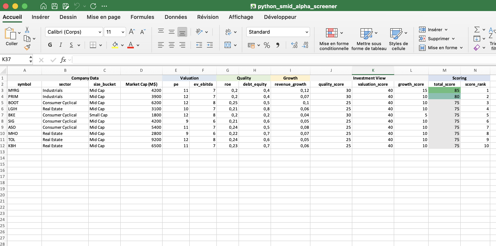

# Python SMID Alpha Screener

A Python-based **fundamental stock screener** designed to identify potentially undervalued **U.S. small and mid-cap equities**.

The model applies a transparent **rule-based scoring framework** combining valuation, quality, and growth metrics.

---

## Investment Framework

The screener evaluates companies across three key pillars:

**Valuation**
- Price-to-Earnings (P/E)
- EV / EBITDA

**Quality**
- Return on Equity (ROE)
- Debt-to-Equity

**Growth**
- Revenue Growth

Each metric receives a score based on predefined thresholds.

Companies are then ranked based on their **Total Score**.

---

## Universe

The model focuses on companies within the **small and mid-cap segment**, inspired by the Russell 2000 universe.

Large-cap companies are excluded to focus on potential **inefficiencies in less-covered segments of the market**.

---

## Workflow
# Python SMID Alpha Screener

A Python-based **fundamental stock screener** designed to identify potentially undervalued **U.S. small and mid-cap equities**.

The model applies a transparent **rule-based scoring framework** combining valuation, quality, and growth metrics.

---

## Investment Framework

The screener evaluates companies across three key pillars:

**Valuation**
- Price-to-Earnings (P/E)
- EV / EBITDA

**Quality**
- Return on Equity (ROE)
- Debt-to-Equity

**Growth**
- Revenue Growth

Each metric receives a score based on predefined thresholds.

Companies are then ranked based on their **Total Score**.

---

## Universe

The model focuses on companies within the **small and mid-cap segment**, inspired by the Russell 2000 universe.

Large-cap companies are excluded to focus on potential **inefficiencies in less-covered segments of the market**.

---

## Workflow
Investment Universe
↓
Financial Data
↓
Fundamental Ratios
↓
Scoring Model
↓
Ranking
↓
Watchlist

---

## Example Output

The screener generates an Excel report containing:

- Watchlist of top ranked companies
- Full scoring table
- Methodology and scoring logic

Example:

---

## Technologies Used

- Python
- Pandas
- OpenPyXL

---

## Author

**Bastien Degeest**

Finance professional interested in **fundamental equity analysis and systematic investment tools**.

LinkedIn  
https://www.linkedin.com/in/bastiendegeest/

---

## Disclaimer

This project is provided for educational purposes only and does not constitute investment advice.

All investment decisions should be based on independent financial research.
